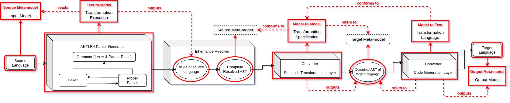

# Delphi Front End Transpiler

This documentation delves into all aspects of the front end transpiler tool, used for translating legacy Delphi DFM files into modern React/TypeScript code.

The Delphi front end transpiler is a tool based on Model-Driven Engineering (MDE) (see the sources below for more information). Its design perfectly aligns with MDE methodologies, and by this design strategy we are able to encapsulate the tool's components into models/artifacts. This allows for separation of concerns and helps in overseeing developmental phases.

The MDE-based transpiler pipeline is depicted below, showcasing the model-based encapsulation of its components:

## Documentation Overview

The documentation starts with parsing Delphi VCL components, represented by the `.dfm` files. Going into details of designing the DFM grammar, which provide a solid foundation and inform the reader on techniques used for expanding said grammar (if necessary in the future).

Once the foundations have been established, a refined and ready-to-use DFM grammar will be looked at, and will be parsed using **ANTLR4** in later sections. The foundation of this project *is* **ANTLRv4**, therefore it's setup and usage are also elaborated.

The transpiler tool leverages *Abstract Syntax Trees (AST)* of the legacy code, to translate them into modern intermediate models of the same level. For this, the documentation delves into implementing *AST* generation, based on a DFM grammar, to ultimately be used as reference for translating to a modern React/TypeScript *AST*.

Once *AST* generation is achieved, the **Semantic Transformation Layer** is elaborated. This component is regarded as the most complex part of this transpiler. It involves several steps: upgrading *AST* node notations, designing and implementing transformation rules, designing the transformation model itself and implementing it.

Following the **Semantic Transformation Layer**, the documentation delves into the final part of the pipeline: the **Code Generation Layer**. This layer will be responsible for generating modern React code, by applying the transformation rules on the translated target *AST*.

### Foreword

Everything related to parsing, is specifically tailored to **ANTLRv4**. Using previous versions of ANTLR would result in several major issues.

The grammar creation of the first chapter, is specifically designed with the [4FOOD ERP](https://www.4foodsoftware.com) system in mind, property of [Estrategy](https://www.estrategysoftware.com). Although most concepts regarding grammar creation truthfully appply, this documentation and all examples provided are specifically designed with DFM files in mind.

The transpiler build detailed in this documentation, is solely based on a specific representative subset of the [4FOOD ERP](https://www.4foodsoftware.com) codebase. It follows, that the transformation rules will specifically be designed with the representative subset in mind. Therefore, the transformation rules will need to be adapted, changed, or expanded when transpiling other subsets. Same goes for the grammar, transformation model, and the code generation layer.

This document assumes familiarity with the general concept of lexers, parsers, grammars, parsing algorithms and methods, and some ANTLR-specific syntax. Knowledge on *ANTLR4* features is not necessarily a prerequisite, as the essential concepts are detailed throughout this documentation. However, we strongly recommend taking an overview on *ANTLR's* full feature list (check for sources below).

*ANTLRv4* relies on the `LL(*)` parsing algorithm, which is a highly suitable for parsing DFM files. This documentation does not delve into the granularity levels of parsing algorithms. Therefore, if the reader wishes to understand *ANTLR's* inner workings and its usage of the `LL(*)` algorithm, we recommend the sources included at the end of this page.

The examples provided throughout the document build upon each other. Therefore, it is necessary to understand them for the purpose of contextualizing and informing on all decisions taken.

#### Sources

In case further context is needed, and the reader would like to delve deeper on the concepts and topics presented throughout this documentation, we highly recommend the following sources:

- [MDA - The Architecture Of Choice For A Changing World](https://www.omg.org/mda/)
- [Model-Driven Engineering](https://en.wikipedia.org/wiki/Model-driven_engineering)
- [ANTLR Main Page](https://www.antlr.org/index.html)
- [ANTLR4 GitHub Documentation](https://github.com/antlr/antlr4/blob/master/doc/index.md)
- [The Definitive ANTLR 4 Reference](https://pragprog.com/titles/tpantlr2/the-definitive-antlr-4-reference/)
- [Stanford University - CS143 Compilers](https://web.stanford.edu/class/archive/cs/cs143/cs143.1128/)
- ["The Dragon Book" - Compilers: Principles, Techniques, and Tools](https://repository.unikom.ac.id/48769/1/Compilers%20-%20Principles,%20Techniques,%20and%20Tools%20(2006).pdf)
- [Parsing Algorithms and LL(k)](https://en.wikipedia.org/wiki/LL_parser#:~:text=The%20LL(k)%20parser%20is,alphabet%20are%20finite%20in%20size.)
- [Delphi Language Reference](https://docwiki.embarcadero.com/RADStudio/Athens/en/Delphi_Language_Reference)
