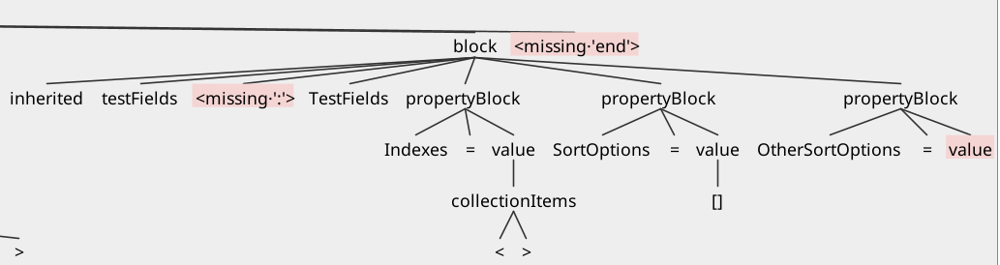

# Features

A neat feature of *ANTLR* is that it will identify missing tokens for us, which can also be visualized in the parse tree GUI.

For example, we introduced two errors in our `test.dfm` pseudo-code, by removing the colon from the inherited object `testFields`, and the closing array bracket in `OtherSortOptions`:

```ini
...

inherited testFields TestFields
    Indexes = <>
    SortOptions = []
    OtherSortOptions = [test1, test2, test3
end

...
```

Let's see what happens if we output a parse tree using the `-gui` command:

```grun DelphiDFM file -gui test.dfm```



We even get the following output in our terminal:

```bash
line 42:27 token recognition error at: '[test1, test2, test3\n    end\n    inherited testMultipleInheritance: TestMultipleInheritance\n        inherited inhOne: InhOne\n            inherited inhTwo: InhTwo\n                inherited inhThree: InhThree\n                    object deepObj: DeepObj\n                        Height = 10\n                        Width = 20\n                        Top = 30\n                    end\n                end\n            end\n        end\n    end\nend'
line 39:25 missing ':' at 'TestFields'
line 57:3 mismatched input '<EOF>' expecting {'<', ARRAY, ID, FLOAT, INT, STRING}
```

This becomes highly useful since we have multpiple ways of identifying issues. Note that errors also get printed when using commands such as `grun DelphiDFM file -tokens test.dfm` where we output all parsed tokens from a file, just like we did previously.

## Important

If the grammar file is modified (in our case `DelphiDFM.g4`), it's always necessary to regenerate and recompile from scratch to avoid stale `.class` files:

```
rm *.java *.class *.tokens *.interp

antlr4 DelphiDFM.g4

javac DelphiDFM*.java
```

# Conclusion

The aim of these first two chapters, was to provide the necessary context for building a language grammar. And additionally, to offer a quick way of parsing desired code, by using the created ANTLR-specific grammar.

We learned the general concepts needed to write a language grammar for parsing with *ANTLRv4*. Then we applied the concepts to write our own DFM grammar, which we used to successfully parse the `test.dfm` pseudo-code. We also learned how to check all tokens of a file, and decomposed them to understand how they are built. Then we checked and represented all identified tokens in a visual parse tree. Finally, we have taken a look at some built-in error reporting features of *ANTLRv4*.