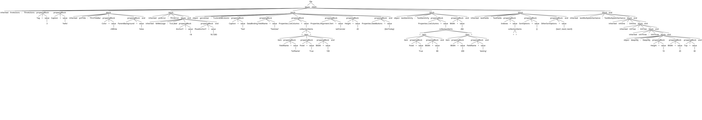

# Parse Trees in ANTLR

So what if we want to see our parse tree? We use the following command for that:

```grun DelphiDFM file -tree test.dfm```

And our output:

```yaml
(file 
    (block inherited frmActions : TfrmActions 
        (propertyBlock Tag = (value 3)) 
        (propertyBlock Caption = (value 'hello')) 

        (block inherited pnlTitle : TfrmTitleBar 
            (propertyBlock Color = (value clWhite)) 
            (propertyBlock ParentBackground = (value False)) 
        end) 

        (block inherited pnlError : TfrmError 
            (block inherited lblMessage : TcxLabel 
                (propertyBlock AnchorY = (value -18)) 
                (propertyBlock FloatAnchorY = (value 18.7283)) 
            end) 
        end) 

        (block object gvListUser : TcxGridDBColumn 
            (propertyBlock Caption = (value 'Test')) 
            (propertyBlock DataBinding.FieldName = (value 'TestUser')) 
            (propertyBlock Properties.ListColumns = (value
                (collectionItems < (item 
                                        item 
                                            (propertyBlock FieldName = (value 'fullName')) 
                                            (propertyBlock Fixed = (value True)) 
                                            (propertyBlock Width = (value 100)) 
                                        end) >))) 
            (propertyBlock Properties.Alignment.Vert = (value taVCencter)) 
            (propertyBlock Height = (value 20)) 
            (propertyBlock Properties.DateButtons = (value [btnToday])) 
        end) 

        (block object testItemHchy : TestItemHchy 
            (propertyBlock Properties.ListColumns = (value 
                (collectionItems < (item 
                                        item 
                                            (propertyBlock Fixed = (value True)) 
                                            (propertyBlock Width = (value 80)) 
                                        end) 
                                    (item 
                                        item 
                                            (propertyBlock Width = (value 200)) 
                                            (propertyBlock FieldName = (value 'testing')) 
                                        end) >))) 
            (propertyBlock Width = (value 282)) 
        end) 

        (block inherited testFields : TestFields 
            (propertyBlock Indexes = (value 
                (collectionItems < >))) 
            (propertyBlock SortOptions = (value [])) 
            (propertyBlock OtherSortOptions = (value [test1, test2, test3])) 
        end) 

        (block inherited testMultipleInheritance : TestMultipleInheritance 
            (block inherited inhOne : InhOne 
                (block inherited inhTwo : InhTwo 
                    (block inherited inhThree : InhThree 
                        (block object deepObj : DeepObj 
                            (propertyBlock Height = (value 10)) 
                            (propertyBlock Width = (value 20)) 
                            (propertyBlock Top = (value 30)) 
                        end) 
                    end) 
                end) 
            end) 
        end) 
    end) 
<EOF>)
```

<span style="color:red">NOTE:</span> The output above was manually modified with newlines for readability purposes, to ultimately demonstrate the presence of hierarchy. 

The real output is actually a continuous line, and looks like this:

```ini
(file (block inherited frmActions : TfrmActions (propertyBlock Tag = (value 3)) (propertyBlock Caption = (value 'hello')) (block inherited pnlTitle : TfrmTitleBar (propertyBlock Color = (value clWhite)) (propertyBlock ParentBackground = (value False)) end) (block inherited pnlError : TfrmError (block inherited lblMessage : TcxLabel (propertyBlock AnchorY = (value -18)) (propertyBlock FloatAnchorY = (value 18.7283)) end) end) (block object gvListUser : TcxGridDBColumn (propertyBlock Caption = (value 'Test')) (propertyBlock DataBinding.FieldName = (value 'TestUser')) (propertyBlock Properties.ListColumns = (value (collectionItems < (item item (propertyBlock FieldName = (value 'fullName')) (propertyBlock Fixed = (value True)) (propertyBlock Width = (value 100)) end) >))) (propertyBlock Properties.Alignment.Vert = (value taVCencter)) (propertyBlock Height = (value 20)) (propertyBlock Properties.DateButtons = (value [btnToday])) end) (block object testItemHchy : TestItemHchy (propertyBlock Properties.ListColumns = (value (collectionItems < (item item (propertyBlock Fixed = (value True)) (propertyBlock Width = (value 80)) end) (item item (propertyBlock Width = (value 200)) (propertyBlock FieldName = (value 'testing')) end) >))) (propertyBlock Width = (value 282)) end) (block inherited testFields : TestFields (propertyBlock Indexes = (value (collectionItems < >))) (propertyBlock SortOptions = (value [])) (propertyBlock OtherSortOptions = (value [test1, test2, test3])) end) (block inherited testMultipleInheritance : TestMultipleInheritance (block inherited inhOne : InhOne (block inherited inhTwo : InhTwo (block inherited inhThree : InhThree (block object deepObj : DeepObj (propertyBlock Height = (value 10)) (propertyBlock Width = (value 20)) (propertyBlock Top = (value 30)) end) end) end) end) end) end) <EOF>)
```

Its contents are the same as the edited example preceding it, and still identifies hierarchy correctly; **notice** the `end` closures at the end of the output.

## Tree Visualization

Thankfully, to simplify our lives, *ANTLR* provides a graphical representation of trees. The test is very simple:

```grun DelphiDFM file -gui test.dfm```

The output:



This gives us a much easier to read output of our parse tree.

Notice that:

- hierarchy is correctly represented.
- each `block` correclty begins and ends.
- we correctly represent positive and negative values for both integers and floating-point values.
- we have correctly accounted for sub-properties.
- `item` list syntax for collection properties correctly begin and end.
- empty `item` lists and `arrays` are correctly parsed.
- we even tested deep hierarchy, just to be sure.

Next up, we'll take a look at some additional useful features of *ANTLR*, and mention some important methodologies to keep in mind.