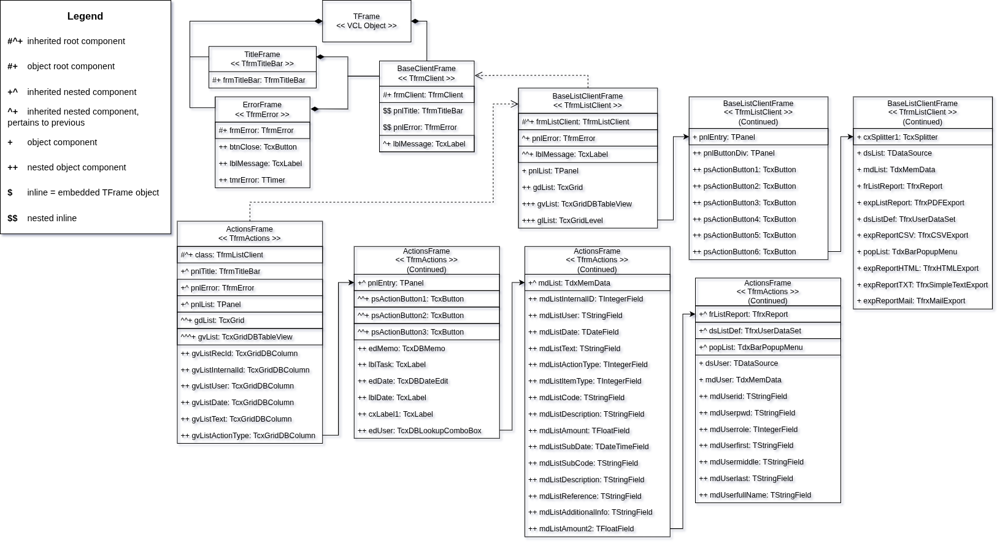

# Introduction

The design of transformation rules (and later on the transformation model) is regarded as the most complex component of this tool. It is a crucial step, which necessitates careful architecting to ensure a valid output.

The transformation rules are comprised of a series of design decisions that specify how the conversion from source *AST* to target *AST* should be executed. This encapsulates the core component of the **Transformation Model**, regarded as the **Semantic Transformation Layer** within the transpiler pipeline.

## Preparations

In order to transpile a DFM file to React, the first step is to identify all dependencies of the chosen file. Determining the inheritance hierarchy of a file is a crucial step in establishing the transformation sequence.

Given a 5-level deep inheritance hierarchy of a chosen subset, we shall establish the philosophy of designing transformations for inherited non-root components. The chosen subset's hierarchy has been traced in the figure below, and is used as reference throughout the process of designing transformation rules:

The transpiling strategy will follow a bottom-up approach, working upwards from the furthest leaf-node: `ActionsFrame.dfm`. This will mean that stubs will be created for missing functionality as the inheritance hierarchy gets transpiled sequentially.

### AST Node Refinement

The first step we'll need to take, is to properly define the node categories:

<table style="width:100%; border-collapse: collapse; table-layout: fixed;">
  <colgroup>
    <col style="width: 22%;">
    <col style="width: 39%;">
    <col style="width: 39%;">
  </colgroup>

  <tr>
    <th style="text-align:left;">Node Categories</th>
    <th style="text-align:left;">Examples</th>
    <th style="text-align:left;"></th>
  </tr>

  <tr>
    <td style="overflow-wrap: anywhere; word-break: break-word;">
      <strong>Layout Properties</strong> These control visual positioning and sizing.  They map directly to CSS style objects in React.
    </td>
    <td style="overflow-wrap: anywhere;">
      • Left • Top • Width • Height • Align • Anchors 
    </td>
    <td style="overflow-wrap: anywhere;">
      • MinWidth  •BestFitMaxWidth • MinSize • DesignSize • ExplicitWidth
    </td>
  </tr>

  <tr>
    <td style="overflow-wrap: anywhere; word-break: break-word;">
      <strong>Visual/Appearance Properties</strong>  These control how a component looks but are not about position.  Will map to CSS styling or component props in React.
    </td>
    <td style="overflow-wrap: anywhere;">
      • Color • ParentColor • ParentBackground • Visible • Caption 
    </td>
    <td style="overflow-wrap: anywhere;">
      • Transparent • BevelOuter • PaintStyle • BorderWidth
    </td>
  </tr>

  <tr>
    <td style="overflow-wrap: anywhere; word-break: break-word;">
      <strong>Behavioral/Configuration Properties</strong> These configure how the component behaves at runtime but do not directly affect layout or appearance.  Typical transition for React: component props.
    </td>
    <td style="overflow-wrap: anywhere;">
      • TabOrder • TabStop • Enabled • AutoSize • SortIndex • SortOrder • SortOptions • GroupIndex 
    </td>
    <td style="overflow-wrap: anywhere;">
      • DisplayWidth • Size • FieldName • Version • DotMatrixReport • Separator • UTF8
    </td>
  </tr>

  <tr>
    <td style="overflow-wrap: anywhere; word-break: break-word;">
      <strong>Namespaced Configuration Properties</strong> These are configuration properties scoped under a sub object. Syntactically they use the <code>SUBPROPERTY</code> token. Semantically they are still configuration but grouped.
    </td>
    <td style="overflow-wrap: anywhere;">
      • Options.Filtering • OptionsData.Editing • OptionsView.CellEndEllipsis • Properties.Alignment.Vert • Properties.WordWrap • SpeedButtonOptions.Transparent 
    </td>
    <td style="overflow-wrap: anywhere;">
      • Constraints.MaxHeight • HotZone.SizePercent • PreviewOptions.Zoom • PrintOptions.Printer  •ReportOptions.CreateDate
    </td>
  </tr>

  <tr>
    <td style="overflow-wrap: anywhere; word-break: break-word;">
      <strong>Data Binding Properties</strong> These connect a UI component to a data source. They have direct implications for React state management.
    </td>
    <td style="overflow-wrap: anywhere;">
      • DataBinding.FieldName • DataBinding.DataField • DataBinding.DataSource 
    </td>
    <td style="overflow-wrap: anywhere;">
       •DataController.DataSource • DataSet
    </td>
  </tr>

  <tr>
    <td style="overflow-wrap: anywhere; word-break: break-word;">
      <strong>Event Handlers</strong> These wire up user interactions or lifecycle events to Object Pascal methods.  In React, they will become callback props or handler functions.
    </td>
    <td style="overflow-wrap: anywhere;">
      • OnClick • OnChange • OnTimer • OnEnter • OnExit • OnResize • OnDblClick • OnGetDisplayText 
    </td>
    <td style="overflow-wrap: anywhere;">
      • OnSendMail • OnCheckEOF • OnFirst • OnNext • OnPrior • OnGetValue • BeforePost
    </td>
  </tr>

  <tr>
    <td style="overflow-wrap: anywhere; word-break: break-word;">
      <strong>Cross Component References</strong> These point to another component either within the same file or in an external module.
    </td>
    <td style="overflow-wrap: anywhere;">
      • FocusControl = edDate • PopupMenu = popList • Control = pnlEntry • GridView = gvList • Properties.ListSource = dsUser 
    </td>
    <td style="overflow-wrap: anywhere;">
      • Action = frmMain.aiAdd • OptionsImage.Images = dmMain.ilNormal16x16 • BarManager = frmMain.BarManager
    </td>
  </tr>

  <tr>
    <td style="overflow-wrap: anywhere; word-break: break-word;">
      <strong>Non Visual Service Components</strong> These are entire component declarations (not individual properties) that have no visual representation. Such as data sources, timers, report generators, exporters, and so on.
    </td>
    <td style="overflow-wrap: anywhere;">
      • TDataSource • TdxMemData • TfrxReport • TfrxPDFExport • TfrxCSVExport • TfrxHTMLExport • TfrxSimpleTextExport • TfrxMailExport 
    </td>
    <td style="overflow-wrap: anywhere;">
      • TfrxUserDataSet • TTimer • TdxBarPopupMenu • TIntegerField • TStringField • TDateField • TFloatField • TDateTimeField
    </td>
  </tr>

</table>